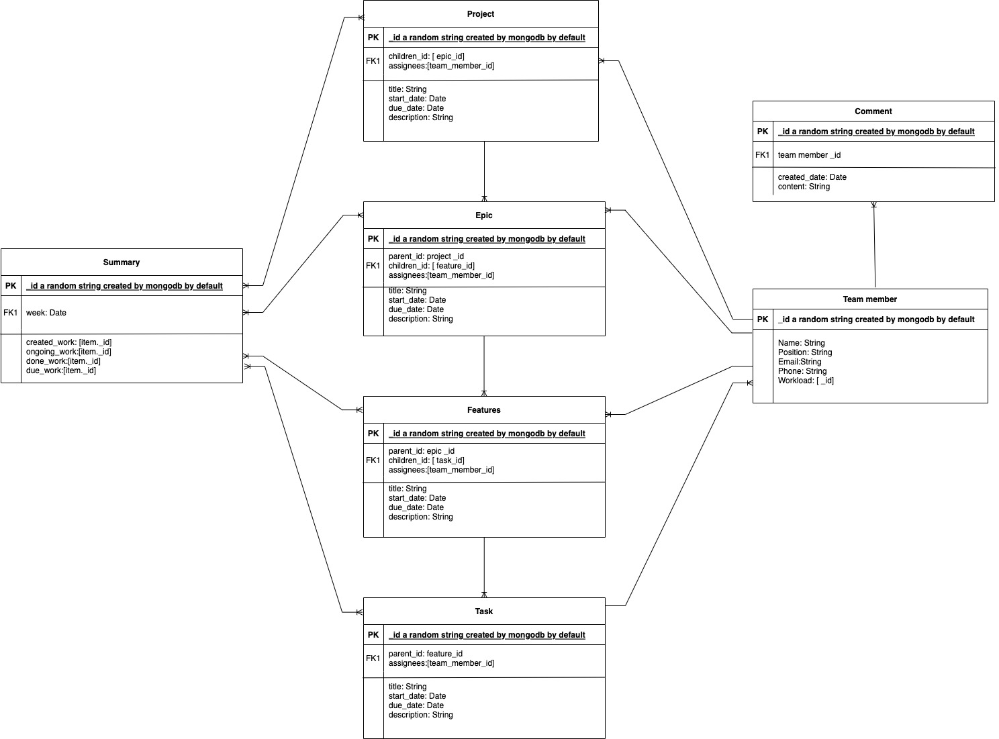

# Shawk-Solution-task-management-system

Shawk solution is developing an eternal-used Task management system aiming to improve collaboration among team members and project efficiency. The methodology of this project was inherited from Agile project management and majorly adapted the sprint board to visualize, categorize, and list project tasks. 

This product includes three major components: 
- Sprint board and task assignment tool
- Team member profile and task lists
- Project tracking page. 

# Figma Prototype

<iframe style="border: 1px solid rgba(0, 0, 0, 0.1);" width="800" height="450" src="https://www.figma.com/embed?embed_host=share&url=https%3A%2F%2Fwww.figma.com%2Fproto%2FNkIhzZUkG7tEyQOjSsZHDj%2FShawkSolution-TMS-Prototype%3Fnode-id%3D137%253A720%26starting-point-node-id%3D137%253A720" allowfullscreen></iframe>

# [Prototype Reference Document](https://docs.google.com/document/d/1cuZ0RojJlK7CYYq7POdE-Z07R27VrrO_OjoTYCR4OzQ/edit?usp=sharing)

# Database
This project use MongoDB to store data. The relational database design diagram shown below

# Tech-skills 
This project used React and Redux to develope front-end, use Node.js to build server, and appply Axios to connect client-side and server.

